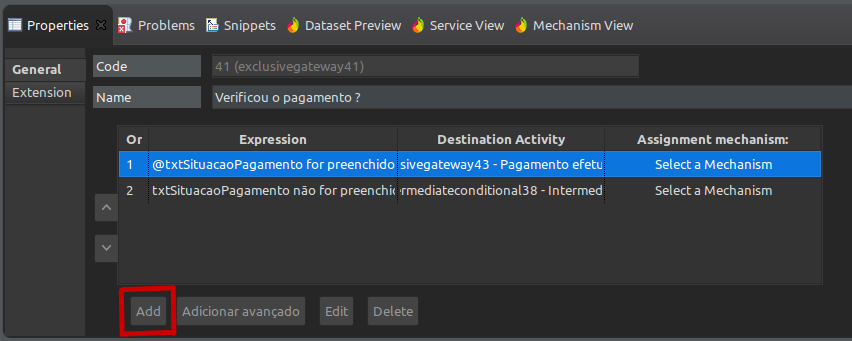
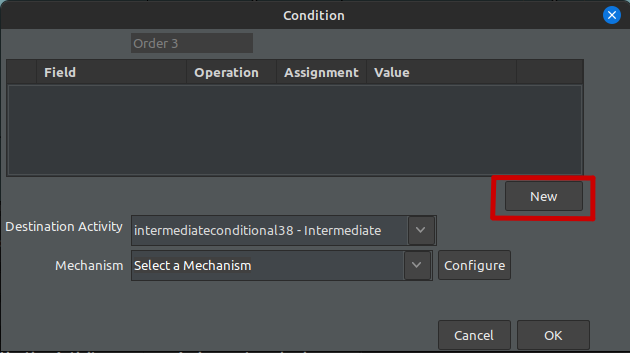
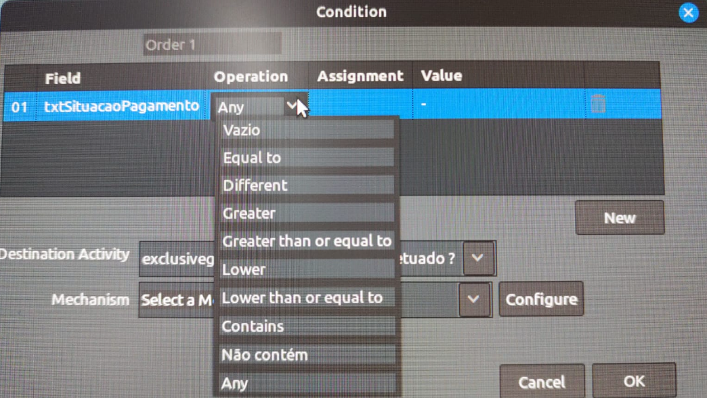
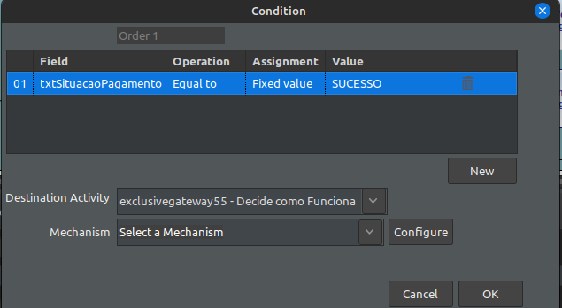

Para adicionar caminhos para os gateways, primeiro você deve clicar no gateway no diagrama : 

Em seguida, clique no botão de adicionar no canto inferior esquerdo. Irá aparecer a seguinte tela :

Agora você irá adicionar o campo que será usado e escolher alguma das operações : 

Geralmente as operações que são escolhidas são o **Equal to** (quando o valor for igual a), **vazio**(não for preenchido) e **Any**(for preenchido)

Segue um exemplo de uso :

No caso a cima, foi escolhido o campo 'txtSituacaoPagamento' para quando o valor deste campo for igual a SUCESSO ele seguir para a atividade destino.