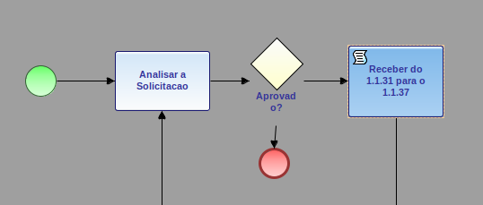
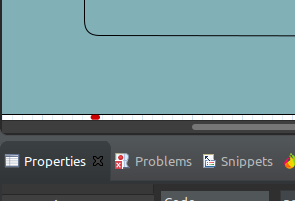
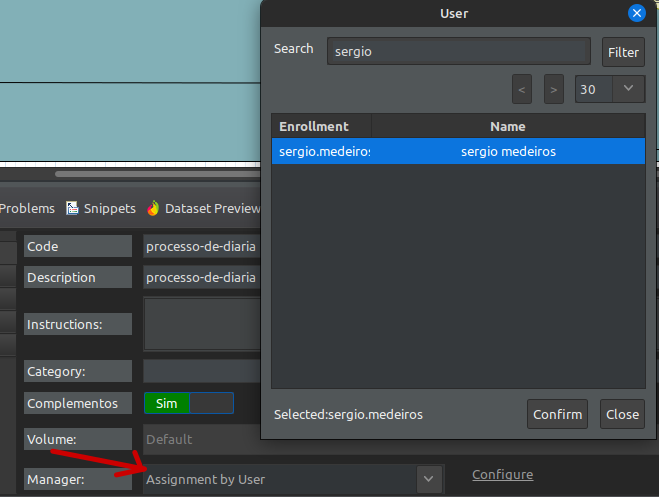

Existem diversas formas de testar um processo no fluig, o processo possui diversas tasks as quais podem ser movimentadas por grupos, usuários, campos do formulário...

Em alguns casos o desenvolvedor pode querer testar o processo passando por tasks que ainda não estão definidas, mas que ele sabe que elas existem, ou que ainda não possuem o seu código ou condições definidas. Neste caso é possível criar a atividade como ``script``. O processo irá passar automaticamente por essa task, sendo possível assim testar o seu fluxo.

Outra forma de facilitar o teste do fluxo do processo é se denominando gerente do processo (``é importante lembrar que após os testes é necessário realocar o gerente anterior``), dessa forma você consegue movimentar todo o processo testando o seu fluxo por inteiro.

Após o click é possível atribuir o gerente do processo

