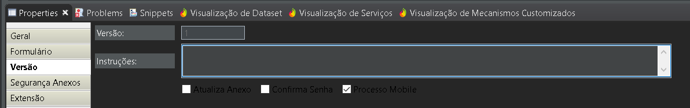

## Para ativar o modo mobile no processo :
* Abrir o eclipse
* Abrir o diagrama do processo
* Clicar na parte 'de fora' do diagrama
* Procurar em `propriedades` a opção `versão`
* Clicar no checkbox com a opção `Processo mobile`
